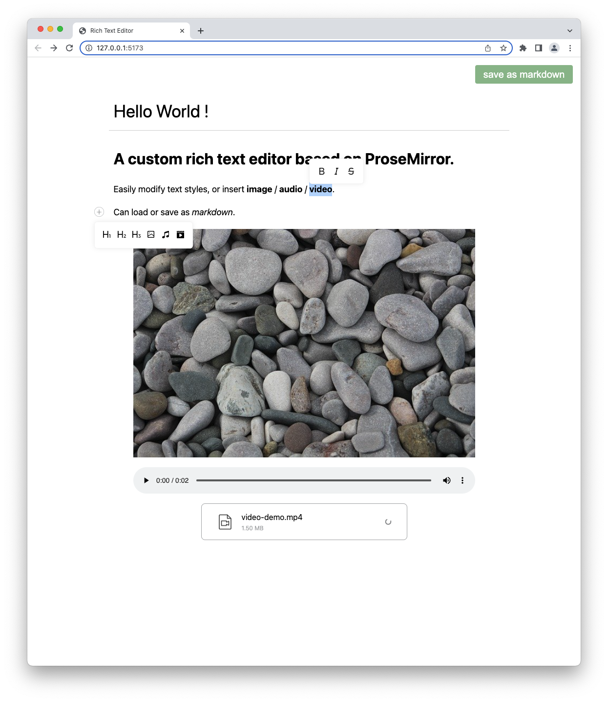

# Rich Text Editor

A custom rich text editor based on ProseMirror.

Easily modify text styles, or insert image / audio / video.  

Can load or save as markdown.


## Screenshot



## Usage
This project can be used directly as a ready-made editor.

Or use `/src/components/Editor.vue` to wrap your own editor.

```sh
yarn
npx patch-package
yarn dev
```


## API
```html
<Editor
    placeholder="type something..."
    :loadContent="loadContent"
    @input="onInput"
    :uploadFile="uploadFile"
/>
```
```js
// "loadContent" should be an async function and return a string in markdown format.
async function loadContent() {
    return '# Hello'
}


// "input" event fires when the content has been changed.
function onInput(content) {
    data.value = content
}


// "uploadFile" should be an async function to upload the file to the server,
// and return an object with 'ok' and 'data' fields.
async function uploadFile(file) {
    return {
        ok: true,
        data: 'https://somepath.xxx/foo.mp3'
    }
}
```
